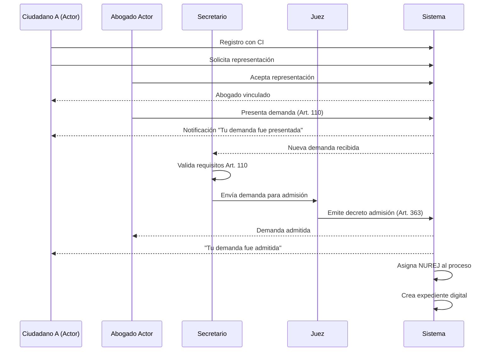
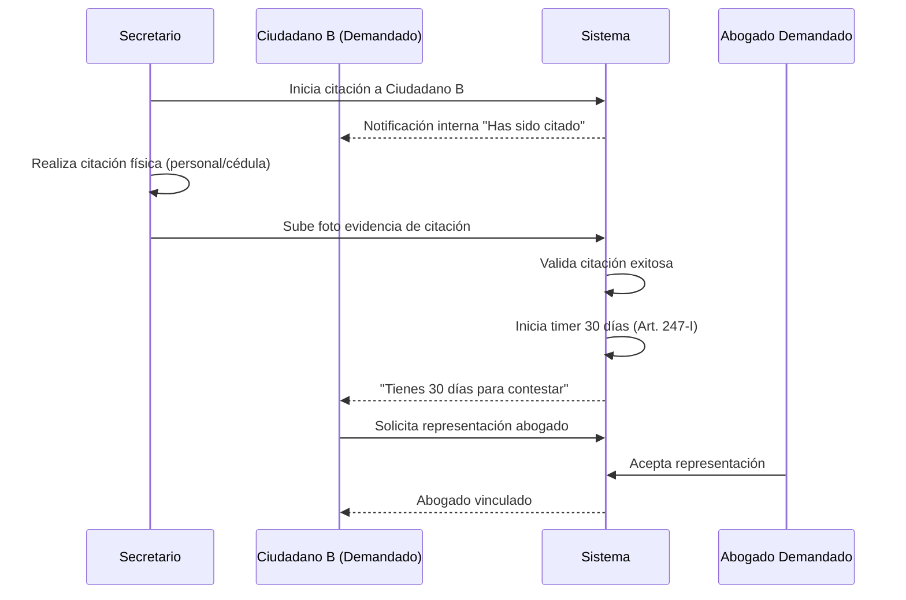
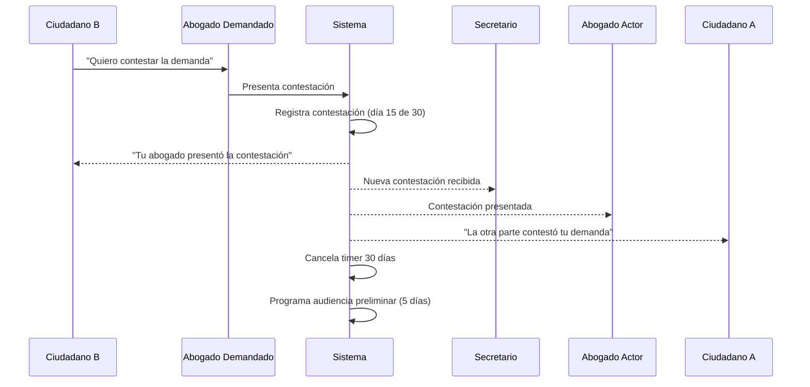
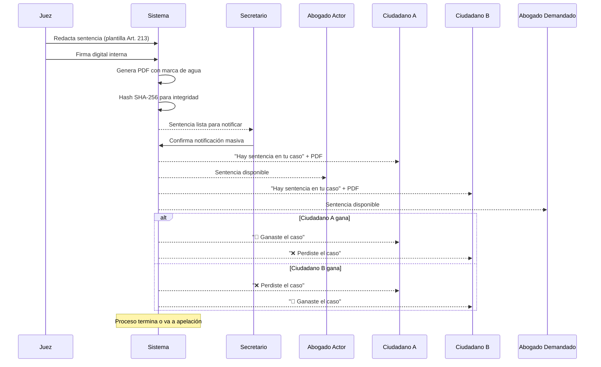

# PRD - Sistema Integral de Gestión Procesal Judicial (SIGPJ)
## PROTOTIPO INTERNO - 4 ROLES

---

## ✅ ESTADO ACTUAL DE IMPLEMENTACIÓN

**Última actualización**: 2025-12-01

### Completado
- ✅ **Schema Prisma completo** (16 modelos, 4 roles: CIUDADANO, ABOGADO, SECRETARIO, JUEZ)
- ✅ **Migración de base de datos** exitosa a Supabase PostgreSQL
- ✅ **Validación del schema** completada
- ✅ **Modelos principales creados**:
  - Usuario con sistema de 4 roles (RolUsuario enum)
  - VinculacionAbogadoCiudadano (sistema de vinculación ciudadano-abogado)
  - Proceso (con estados: BORRADOR → SENTENCIADO → EJECUTORIADO)
  - Demanda (validación Art. 110 Ley 439)
  - ParteEnProceso (Actor, Demandado, Tercero)
  - MedidaCautelar (con timer automático 30 días)
  - Citacion (Personal, Cédula, Edicto, Tácita)
  - Audiencia (Preliminar y Complementaria)
  - Resolucion y Sentencia (estructura Art. 213)
  - Plazo (automatización de plazos procesales)
  - Documento (con hash SHA-256 para integridad)
  - AccesoExpediente (auditoría de accesos)
  - NotificacionInterna (sistema interno de notificaciones)
  - Mensaje (chat ciudadano-abogado con Supabase Realtime)

### En Progreso
- 🔄 Ninguna tarea actualmente en progreso

### Pendiente
- ⏳ Configurar Supabase Auth
- ⏳ Sistema de roles y permisos (RBAC)
- ⏳ Registro Ciudadano
- ⏳ Registro Abogado
- ⏳ Login diferenciado por rol
- ⏳ Dashboards (4 roles)
- ⏳ Sistema vinculación Ciudadano-Abogado
- ⏳ Chat Ciudadano-Abogado
- ⏳ Módulo Demandas
- ⏳ Módulo Citaciones
- ⏳ Módulo Audiencias
- ⏳ Módulo Sentencias

### Stack Técnico Confirmado
- **Frontend**: Next.js 15 + React 19 + TypeScript
- **Backend**: Next.js API Routes + Prisma ORM
- **Base de datos**: PostgreSQL (Supabase) ✅
- **Autenticación**: Supabase Auth
- **Storage**: Supabase Storage
- **UI**: Radix UI + Tailwind CSS
- **Real-time**: Supabase Realtime (chat)
- **Video**: Jitsi Meet / Daily.co
- **AI**: OpenAI Whisper (transcripción audiencias)
- **Deploy**: Vercel

---

## 1. VISIÓN Y CONTEXTO

### 1.1 Problema
El proceso ordinario boliviano (Ley 439) actualmente opera con:
- Expedientes físicos propensos a pérdida/deterioro
- Ciudadanos sin visibilidad del estado de sus procesos
- Citaciones físicas (edictos en periódicos) costosas e ineficientes
- Plazos procesales sin monitoreo automático causando vencimientos
- Audiencias presenciales con alta tasa de reprogramación
- Tiempo promedio de resolución: 300+ días
- Falta de trazabilidad de actos procesales
- Ciudadanos dependientes 100% de sus abogados sin acceso directo

### 1.2 Solución
Plataforma web integral (prototipo interno) que digitaliza el 100% del proceso ordinario, desde que el **ciudadano** inicia el proceso hasta la sentencia final, con **4 roles diferenciados** (Ciudadano, Abogado, Secretario, Juez), automatización de plazos, citaciones digitales, audiencias virtuales y expediente digital único con acceso transparente para todos los actores.

### 1.3 Visión
Prototipo funcional que demuestre la viabilidad de digitalizar el proceso ordinario con participación directa del ciudadano, reduciendo tiempos en 40%, eliminando papel en 95%, y dando transparencia total al justiciable.

## 2. OBJETIVOS Y MÉTRICAS

### Objetivos Cuantitativos
- Reducir tiempo promedio de 300 a 180 días (40%)
- Digitalizar 95% de documentos
- 100% ciudadanos con acceso a su expediente 24/7
- Lograr 90% citaciones efectivas en primer intento
- 80%+ cumplimiento de plazos procesales
- Piloto con 10 juzgados + 500 ciudadanos en 12 semanas

### Objetivos Cualitativos
- Eliminar pérdida de expedientes
- **Transparencia total para ciudadanos** (acceso directo, no solo a través de abogado)
- Reducir costos operativos del órgano judicial
- Empoderar al ciudadano con información clara y actualizada
- Mejorar experiencia de usuario (NPS >70)
- Garantizar trazabilidad inmutable de actos

## 3. USUARIOS Y PERSONAS (4 ROLES CORE)

### ROL 1: CIUDADANO (Nuevo - Actor Principal del Sistema)

**Descripción**: Persona natural que inicia un proceso judicial (como actor) o es demandada (como demandado). Es el usuario final del sistema de justicia.

#### Perfil
- **Edad**: 18-80 años
- **Tech-savvy**: Bajo-Medio
- **Educación**: Variable (desde primaria hasta posgrado)
- **Dolor Principal**:
  - No sabe en qué estado está su proceso
  - Depende 100% de su abogado para información
  - No puede ver documentos de su caso
  - No sabe cuándo tiene que ir a audiencia
  - Siente que el sistema judicial es una "caja negra"

#### Necesidades
- Ver el estado de MI proceso en lenguaje simple (no legal)
- Recibir notificaciones claras cuando pasa algo en mi caso
- Comunicarme con mi abogado dentro del sistema
- Subir pruebas (fotos, documentos) directamente
- Saber cuándo tengo audiencia
- Entender qué significa cada etapa del proceso

#### Funcionalidades (Permisos)
✅ **Puede hacer**:
- Registrarse en el sistema con CI
- Ver sus procesos (como actor o demandado)
- Solicitar representación de abogado
- Vincular/desvincular abogado
- Ver expediente digital simplificado (sin tecnicismos legales)
- Recibir notificaciones de citaciones
- Recibir notificaciones de resoluciones importantes
- Subir pruebas documentales (fotos, PDFs, videos)
- Ver calendario de audiencias
- Participar en audiencias virtuales (junto a su abogado)
- Descargar resoluciones en PDF
- Chatear con su abogado
- Ver línea de tiempo simplificada del caso

❌ **NO puede hacer**:
- Presentar demandas (requiere abogado)
- Presentar escritos legales técnicos
- Ver documentos internos del juzgado
- Editar documentos oficiales
- Contactar directamente al juez
- Ver casos de otros ciudadanos

#### User Stories
- **US-C1**: Como ciudadano, quiero registrarme con mi CI para acceder al sistema
- **US-C2**: Como ciudadano, quiero ver el estado de mi caso en lenguaje simple sin términos legales
- **US-C3**: Como ciudadano, quiero buscar y solicitar representación de un abogado
- **US-C4**: Como ciudadano, quiero recibir notificación en mi celular cuando me citan
- **US-C5**: Como ciudadano, quiero subir fotos de pruebas directamente al sistema
- **US-C6**: Como ciudadano, quiero ver cuándo es mi audiencia y unirme con 1 click
- **US-C7**: Como ciudadano, quiero chatear con mi abogado dentro del sistema
- **US-C8**: Como ciudadano, quiero entender en qué etapa va mi proceso con una línea de tiempo visual

#### Dashboard Ciudadano
```
┌─────────────────────────────────────────────┐
│  MIS PROCESOS                                │
├─────────────────────────────────────────────┤
│  📋 Caso #12345-2025                         │
│  Estado: En Audiencia Preliminar 🟡          │
│  Mi rol: Actor (Demandante)                 │
│  Contra: Juan Pérez                          │
│  Mi abogado: Dr. Carlos López                │
│  Próxima acción: Audiencia 15 Ene 2025      │
│  [Ver Detalle] [Subir Prueba] [Chat]       │
├─────────────────────────────────────────────┤
│  🔔 NOTIFICACIONES (3 nuevas)                │
│  • Citación recibida - Responder en 25 días │
│  • Tu abogado subió un documento            │
│  • Audiencia programada para el 15/01       │
└─────────────────────────────────────────────┘
```

---

### ROL 2: ABOGADO

**Descripción**: Profesional del derecho que representa a uno o más ciudadanos en sus procesos.

#### Perfil
- **Edad**: 25-60 años
- **Tech-savvy**: Medio-Alto
- **Dolor Principal**:
  - Gestionar múltiples clientes y casos
  - Incertidumbre sobre estado del caso
  - Viajes constantes al juzgado
  - Clientes preguntando constantemente por su caso

#### Necesidades
- Ver todos los casos de mis clientes en un solo lugar
- Acceso remoto a expedientes completos
- Notificaciones de plazos próximos a vencer
- Comunicación directa con clientes dentro del sistema
- Presentar escritos digitalmente

#### Funcionalidades (Permisos)
✅ **Puede hacer**:
- Registrarse con número de registro profesional
- Ver solicitudes de representación de ciudadanos
- Aceptar/rechazar representación
- Ver todos los casos de sus clientes
- Presentar demandas en nombre de ciudadanos
- Acceso completo a expedientes técnicos de sus casos
- Presentar escritos legales (contestación, excepciones, reconvención)
- Upload de pruebas documentales
- Participar en audiencias virtuales representando a cliente
- Recibir alertas de plazos
- Chatear con sus clientes
- Descargar expedientes completos en PDF

❌ **NO puede hacer**:
- Ver casos de otros abogados (salvo que sea parte)
- Emitir resoluciones judiciales
- Acceder a comentarios internos del juzgado
- Modificar resoluciones del juez

#### User Stories
- **US-A1**: Como abogado, quiero ver solicitudes de representación pendientes
- **US-A2**: Como abogado, quiero presentar demanda en nombre de mi cliente con wizard guiado
- **US-A3**: Como abogado, quiero ver dashboard con plazos por vencer de todos mis casos
- **US-A4**: Como abogado, quiero recibir alerta 5 días antes de vencimiento de plazo
- **US-A5**: Como abogado, quiero chatear con mi cliente para pedirle documentos
- **US-A6**: Como abogado, quiero compartir pantalla en audiencia virtual

#### Dashboard Abogado
```
┌─────────────────────────────────────────────┐
│  MIS CASOS (15)                              │
├─────────────────────────────────────────────┤
│  🔴 URGENTE (3)                              │
│  • Caso #12345 - Contestación vence en 2d   │
│  • Caso #12346 - Audiencia mañana 9:00 AM   │
│                                              │
│  🟡 POR VENCER (5)                           │
│  🟢 AL DÍA (7)                               │
│                                              │
│  💼 SOLICITUDES DE REPRESENTACIÓN (2)        │
│  • María García solicita representación     │
│    [Aceptar] [Rechazar] [Ver Detalle]      │
└─────────────────────────────────────────────┘
```

---

### ROL 3: SECRETARIO JUDICIAL

**Descripción**: Funcionario judicial que administra el expediente, gestiona notificaciones y coordina audiencias. Ahora incluye funciones de citación (antes "Oficial de Diligencias").

#### Perfil
- **Edad**: 28-45 años
- **Tech-savvy**: Medio
- **Dolor Principal**:
  - Gestión manual de notificaciones a ciudadanos
  - Archivo físico de expedientes
  - Citaciones fallidas sin evidencia
  - Coordinación de audiencias con múltiples partes

#### Necesidades
- Automatización de citaciones a ciudadanos
- Organización digital de expedientes
- Registro de evidencia de citaciones
- Notificación masiva a ciudadanos, abogados

#### Funcionalidades (Permisos)
✅ **Puede hacer**:
- Ver todos los procesos del juzgado asignado
- Recibir y validar demandas
- Citar a ciudadanos (registro manual con evidencia fotográfica)
- Notificar a ciudadanos y abogados
- Subir documentos al expediente
- Agendar audiencias
- Gestionar calendario del juez
- Registrar asistencia en audiencias
- Generar actas de audiencias
- Ver estadísticas del juzgado
- Comentarios internos (solo visible para juez y secretarios)

❌ **NO puede hacer**:
- Emitir resoluciones judiciales
- Firmar sentencias
- Admitir o rechazar demandas (solo el juez)
- Modificar documentos firmados

#### User Stories
- **US-S1**: Como secretario, quiero citar a un ciudadano y subir foto del acta de citación
- **US-S2**: Como secretario, quiero enviar notificación automática a todos los actores cuando hay una resolución
- **US-S3**: Como secretario, quiero ver lista de ciudadanos que debo citar esta semana
- **US-S4**: Como secretario, quiero agendar audiencia y que sistema notifique a juez, abogados y ciudadanos
- **US-S5**: Como secretario, quiero registrar quién asistió a la audiencia

---

### ROL 4: JUEZ CIVIL

**Descripción**: Autoridad judicial que dirige el proceso y emite resoluciones.

#### Perfil
- **Edad**: 35-55 años
- **Tech-savvy**: Medio-Bajo
- **Dolor Principal**:
  - Sobrecarga de casos
  - Plazos vencidos
  - Expedientes perdidos
  - Falta de información actualizada de ciudadanos

#### Necesidades
- Dashboard claro de casos con ciudadanos identificados
- Alertas automáticas de plazos
- Emisión rápida de resoluciones
- Ver información de ciudadanos actor y demandado

#### Funcionalidades (Permisos)
✅ **Puede hacer**:
- Ver todos los procesos asignados con datos de ciudadanos
- Emitir decretos de admisión/observación
- Emitir autos interlocutorios
- Presidir audiencias virtuales con ciudadanos y abogados
- Redactar y firmar sentencias
- Ver dashboard de plazos por vencer
- Acceso completo a expedientes digitales
- Comentarios internos (no visibles para ciudadanos/abogados)
- Ver historial completo de ciudadanos en sistema

❌ **NO puede hacer**:
- Chatear directamente con ciudadanos (debe ser a través de resoluciones oficiales)
- Modificar documentos presentados por abogados
- Eliminar actos procesales (inmutabilidad)

#### User Stories
- **US-J1**: Como juez, quiero ver dashboard Kanban con foto y nombre de ciudadanos en cada caso
- **US-J2**: Como juez, quiero recibir alerta cuando plazo está por vencer
- **US-J3**: Como juez, quiero emitir sentencia y que llegue automático a ciudadano y abogado
- **US-J4**: Como juez, quiero ver en audiencia virtual tanto a abogados como a ciudadanos representados

---

## 4. FLUJO COMPLETO DEL PROCESO ORDINARIO (4 ROLES)

### ETAPA 1: INICIO DEL PROCESO 🚀



**Detalle paso a paso**:

1. **Ciudadano A** se registra en el sistema con su CI
2. **Ciudadano A** busca abogado en el sistema (o ingresa código de abogado)
3. **Ciudadano A** envía solicitud de representación a **Abogado**
4. **Abogado** recibe notificación y acepta representación
5. **Abogado** accede a wizard de nueva demanda
6. **Abogado** llena formulario 5 pasos (Art. 110):
   - Paso 1: Datos del juez/tribunal
   - Paso 2: Datos completos de **Ciudadano A** (actor) y **Ciudadano B** (demandado)
   - Paso 3: Objeto, hechos, derecho
   - Paso 4: Petitorio, valor, prueba
   - Paso 5: Preview y envío
7. Sistema valida automáticamente requisitos Art. 110
8. **Secretario** recibe demanda en su bandeja
9. **Secretario** valida formalmente y envía a **Juez**
10. **Juez** revisa y emite decreto de admisión (Art. 363)
11. Sistema notifica a **Ciudadano A**: "✅ Tu demanda fue admitida. Ahora citaremos a [Ciudadano B]"
12. Sistema notifica a **Abogado**: "✅ Demanda #12345 admitida"
13. Sistema crea expediente digital con NUREJ único

---

### ETAPA 2: CITACIÓN DEL DEMANDADO 📨



**Detalle paso a paso**:

1. **Juez** ordena citación de **Ciudadano B** (demandado)
2. **Secretario** inicia proceso de citación en sistema
3. Sistema genera notificación interna para **Ciudadano B** (si está registrado)
4. Sistema muestra a **Secretario** datos de **Ciudadano B**: domicilio, teléfono
5. **Secretario** realiza citación física:
   - Opción A: Personal (va al domicilio, entrega cédula, toma foto)
   - Opción B: Cédula (deja con familiar, toma foto del acta)
   - Opción C: Edicto (publicación en sistema)
6. **Secretario** sube evidencia fotográfica al sistema
7. Sistema valida que citación fue exitosa
8. Sistema inicia timer automático de 30 días (Art. 247-I)
9. **Ciudadano B** ve en su dashboard (si está registrado):
   ```
   🔴 CITACIÓN URGENTE
   Has sido citado en el caso #12345-2025
   Actor: María García
   Tienes 25 días restantes para contestar
   [Buscar Abogado] [Ver Demanda]
   ```
10. **Ciudadano B** busca y solicita representación de **Abogado**
11. **Abogado** acepta y queda vinculado al caso

---

### ETAPA 3: CONTESTACIÓN 📝



**Detalle paso a paso**:

1. **Ciudadano B** se reúne con su **Abogado** (físicamente o por videollamada)
2. **Ciudadano B** aporta información y pruebas a su **Abogado**
3. **Ciudadano B** sube documentos/fotos al sistema (visibles para su **Abogado**)
4. **Abogado** de **Ciudadano B** presenta contestación:
   - Opción A: Contestar (responde punto por punto)
   - Opción B: Allanarse (acepta la demanda)
   - Opción C: Excepciones previas (incompetencia, falta de personería, etc.)
   - Opción D: Reconvenir (contra-demandar)
5. Sistema registra contestación con timestamp
6. Sistema cancela timer de 30 días
7. Sistema notifica a **Ciudadano B**:
   ```
   ✅ Tu abogado presentó la contestación
   Próximo paso: Audiencia Preliminar (será agendada en 5 días)
   ```
8. Sistema notifica a **Secretario**: Nueva contestación en caso #12345
9. **Secretario** revisa y pasa a **Juez**
10. Sistema notifica a **Abogado** de **Ciudadano A**: "La otra parte contestó"
11. Sistema notifica a **Ciudadano A**:
    ```
    📋 Novedad en tu caso
    La otra parte (Juan Pérez) presentó su contestación
    Tu abogado la está revisando
    [Ver Contestación Simplificada]
    ```
12. Sistema programa auto-convocatoria de audiencia preliminar para dentro de 5 días

---

### ETAPA 4: AUDIENCIA PRELIMINAR 🎥

```mermaid
sequenceDiagram
    participant Sist as Sistema
    participant S as Secretario
    participant J as Juez
    participant Ab1 as Abogado Actor
    participant C1 as Ciudadano A
    participant C2 as Ciudadano B
    participant Ab2 as Abogado Demandado

    Sist->>S: Auto-convoca audiencia (5 días post-contestación)
    S->>Sist: Agenda fecha/hora

    Sist-->>C1: "Tienes audiencia el 15 Ene 9:00 AM"
    Sist-->>Ab1: Audiencia agendada
    Sist-->>C2: "Tienes audiencia el 15 Ene 9:00 AM"
    Sist-->>Ab2: Audiencia agendada
    Sist-->>J: Audiencia en tu calendario

    Note over Sist: DÍA DE LA AUDIENCIA

    C1->>Sist: Ingresa a sala virtual
    Ab1->>Sist: Ingresa a sala virtual
    C2->>Sist: Ingresa a sala virtual
    Ab2->>Sist: Ingresa a sala virtual
    J->>Sist: Inicia audiencia (preside)

    J->>Ab1: Ratifica demanda
    J->>Ab2: Ratifica contestación
    J->>C1,C2: Propone conciliación

    alt Hay acuerdo
        C1,C2->>J: Aceptan conciliación
        J->>Sist: Registra acuerdo
        Sist->>Sist: Genera sentencia homologatoria
    else No hay acuerdo
        J->>Sist: Fija objeto del proceso
        Sist->>Sist: Programa audiencia complementaria (15d)
    end

    Sist->>Sist: Graba audiencia (Supabase Storage)
    Sist->>Sist: Transcribe con Whisper
    S->>Sist: Genera acta final
```

**Detalle paso a paso**:

1. Sistema auto-convoca audiencia 5 días después de contestación (Art. 365)
2. **Secretario** agenda fecha y hora específica
3. Sistema envía notificaciones a todos:
   - **Ciudadano A** ve en dashboard:
     ```
     📅 AUDIENCIA PRÓXIMA
     Fecha: 15 Enero 2025 - 9:00 AM
     Tipo: Audiencia Preliminar
     ¿Qué pasa aquí? El juez intentará que lleguen a un acuerdo
     [Unirse a Videollamada] [Ver Guía de Audiencia]
     ```
   - **Ciudadano B** ve lo mismo
   - **Abogados** ven notificación profesional con detalles técnicos
   - **Juez** ve en su calendario con datos de ambos ciudadanos

4. **DÍA DE LA AUDIENCIA**:

5. **Hora de inicio - 5 minutos**: Sistema envía recordatorio a todos
6. **Hora de inicio**: Sala virtual se activa (Jitsi/Daily.co)
7. Todos ingresan a sala virtual:
   - **Juez** (preside)
   - **Secretario** (toma notas)
   - **Abogado** de **Ciudadano A**
   - **Ciudadano A**
   - **Abogado** de **Ciudadano B**
   - **Ciudadano B**

8. **Juez** dirige audiencia (Art. 366):
   - Ratificación de demanda por **Abogado Actor**
   - Ratificación de contestación por **Abogado Demandado**
   - **Juez** pregunta directamente a **Ciudadanos** si están de acuerdo con lo que dijeron sus abogados
   - **Juez** propone conciliación: "¿Pueden llegar a un acuerdo?"

9. **ESCENARIO A: HAY ACUERDO** ✅
   - **Ciudadano A** y **Ciudadano B** aceptan conciliar
   - **Juez** dicta acuerdo en acta
   - Sistema registra acuerdo
   - **Juez** emite sentencia homologatoria (15 días)
   - Sistema notifica a ambos ciudadanos: "¡Llegaron a un acuerdo! El juez emitirá sentencia en 15 días"
   - Proceso termina

10. **ESCENARIO B: NO HAY ACUERDO** ❌
    - **Ciudadanos** no llegan a acuerdo
    - **Juez** fija objeto del proceso (qué se va a discutir)
    - **Juez** ordena prueba en audiencia complementaria
    - Sistema programa audiencia complementaria (15 días)
    - Sistema notifica a ambos ciudadanos: "No hubo acuerdo. Próxima audiencia: 30 Enero 2025"

11. **POST-AUDIENCIA**:
    - Sistema automáticamente graba toda la audiencia (video + audio en Supabase Storage)
    - Sistema envía audio a OpenAI Whisper para transcripción
    - Whisper devuelve transcripción completa identificando hablantes
    - **Secretario** revisa transcripción y genera acta oficial
    - Acta se sube al expediente digital
    - Todos los participantes reciben copia del acta

---

### ETAPA 5: AUDIENCIA COMPLEMENTARIA (si aplica) 🎥

**Detalle paso a paso**:

1. Si en audiencia preliminar no se completó toda la prueba → Se programa complementaria (Art. 368)
2. Plazo: Máximo 15 días después
3. Mismo flujo que audiencia preliminar pero enfocada en PRUEBA:
   - **Abogados** presentan pruebas digitales (compartir pantalla)
   - **Ciudadanos** pueden aportar testimonios
   - Peritajes, inspecciones
   - **Juez** valora pruebas
4. Al final: **Juez** declara cerrada etapa probatoria
5. Sistema notifica a **Ciudadanos**: "Fase de pruebas terminó. Ahora el juez tiene 20 días para emitir sentencia"

---

### ETAPA 6: SENTENCIA ⚖️



**Detalle paso a paso**:

1. **Juez** tiene máximo 20 días para emitir sentencia (Art. 216)
2. Sistema alerta a **Juez** en día 15: "Tienes 5 días para emitir sentencia en caso #12345"
3. **Juez** accede a editor de sentencias
4. Sistema presenta plantilla obligatoria (Art. 213):
   ```
   ┌─────────────────────────────────────────┐
   │ SENTENCIA #12345-2025                    │
   ├─────────────────────────────────────────┤
   │ 1. ENCABEZAMIENTO                        │
   │ Proceso: #12345                          │
   │ Actor: María García (Ciudadano A)       │
   │ Demandado: Juan Pérez (Ciudadano B)     │
   │ Objeto: [Juez completa]                  │
   │                                          │
   │ 2. NARRATIVA                             │
   │ [Juez redacta hechos]                    │
   │                                          │
   │ 3. MOTIVA                                │
   │ [Juez analiza pruebas y cita leyes]     │
   │                                          │
   │ 4. RESOLUTIVA                            │
   │ [Juez decide: Admite/Rechaza demanda]   │
   └─────────────────────────────────────────┘
   ```
5. **Juez** completa cada sección
6. Sistema valida que ninguna sección esté vacía
7. **Juez** solicita firma digital interna
8. Sistema genera hash SHA-256 del documento
9. Sistema firma con certificado interno (sin AGETIC en prototipo)
10. Sistema genera PDF con marca de agua oficial
11. Sistema almacena en expediente digital
12. **Secretario** confirma notificación masiva
13. Sistema notifica a **TODOS**:

    **Notificación a Ciudadano A (Actor)**:
    ```
    ⚖️ SENTENCIA EMITIDA

    Caso: #12345-2025
    Fecha: 5 Febrero 2025

    RESULTADO: FAVORABLE ✅

    El juez admitió tu demanda.
    Juan Pérez debe [cumplir con lo pedido]

    [Descargar Sentencia PDF]
    [Ver Resumen Simple]
    [Hablar con mi Abogado]
    ```

    **Notificación a Ciudadano B (Demandado)**:
    ```
    ⚖️ SENTENCIA EMITIDA

    Caso: #12345-2025
    Fecha: 5 Febrero 2025

    RESULTADO: DESFAVORABLE ❌

    El juez admitió la demanda de María García.
    Debes [cumplir con lo ordenado]

    ¿Quieres apelar? Tienes 15 días.
    Habla con tu abogado.

    [Descargar Sentencia PDF]
    [Ver Resumen Simple]
    [Hablar con mi Abogado]
    ```

14. Sistema actualiza estado del proceso a "SENTENCIADO"
15. Si hay apelación → Proceso continúa en segunda instancia
16. Si no hay apelación en 15 días → Proceso queda ejecutoriado

---

## 5. MATRIZ DE INTERACCIONES ENTRE 4 ROLES

| Acción/Evento | Ciudadano | Abogado | Secretario | Juez |
|---------------|-----------|---------|------------|------|
| **Registro en sistema** | ✅ Se registra con CI | ✅ Se registra con registro profesional | ✅ Asignado por admin | ✅ Asignado por admin |
| **Iniciar proceso** | ✅ Solicita a abogado | ✅ Presenta demanda formal | ❌ | ❌ |
| **Admisión demanda** | ✅ Ve notificación | ✅ Ve notificación | ✅ Valida formalmente | ✅ Emite decreto |
| **Citación** | ✅ Recibe notificación | ✅ Ve estado | ✅ Ejecuta y sube evidencia | ✅ Autoriza |
| **Vinculación abogado** | ✅ Solicita representación | ✅ Acepta/rechaza | ❌ | ❌ |
| **Contestación** | ✅ Ve estado simple | ✅ Presenta escrito | ✅ Registra | ✅ Revisa |
| **Subir pruebas** | ✅ Fotos/docs básicos | ✅ Pruebas técnicas | ✅ Organiza en expediente | ✅ Valora |
| **Audiencia** | ✅ Participa (voz) | ✅ Representa (técnico) | ✅ Coordina y transcribe | ✅ Preside |
| **Conciliación** | ✅ Decide aceptar/rechazar | ✅ Asesora | ✅ Registra acuerdo | ✅ Propone |
| **Sentencia** | ✅ Recibe resumen simple | ✅ Recibe técnica completa | ✅ Notifica | ✅ Emite |
| **Chat** | ✅ Con su abogado | ✅ Con sus clientes | ❌ | ❌ |
| **Expediente** | ✅ Vista simplificada | ✅ Vista completa técnica | ✅ Gestiona todo | ✅ Vista completa |
| **Comentarios internos** | ❌ No ve | ❌ No ve | ✅ Ve y comenta | ✅ Ve y comenta |
| **Plazos** | ✅ Ve días restantes | ✅ Ve alertas técnicas | ✅ Monitorea todos | ✅ Ve críticos |

---

## 6. MÓDULOS DEL SISTEMA (ACTUALIZADOS PARA 4 ROLES)

### MÓDULO 1: GESTIÓN DE USUARIOS Y ROLES

**Objetivo**: Permitir registro y gestión diferenciada de los 4 roles.

#### Funcionalidades:

**1.1 Registro de Ciudadano**
- Formulario con CI, nombres, apellidos, email, teléfono, domicilio
- Verificación de CI (validación formato boliviano)
- Creación de perfil básico
- Dashboard ciudadano personalizado

**1.2 Registro de Abogado**
- Formulario con registro profesional, CI, nombres, email
- Validación de número de registro (formato: LP-12345)
- Carga de certificado de vigencia (PDF)
- Dashboard abogado con casos

**1.3 Asignación de Secretario**
- Admin crea cuenta
- Asignación a juzgado específico
- Permisos de gestión de expedientes

**1.4 Asignación de Juez**
- Admin crea cuenta
- Asignación a juzgado y materia
- Permisos completos de emisión de resoluciones

**Archivos**:
```
src/app/(auth)/registro/
  ├── ciudadano/page.tsx
  ├── abogado/page.tsx
src/app/(dashboard)/perfil/
  ├── page.tsx
  ├── ciudadano-view.tsx
  ├── abogado-view.tsx
  ├── secretario-view.tsx
  ├── juez-view.tsx
src/lib/validations/
  ├── ciudadano-schema.ts
  ├── abogado-schema.ts
```

---

### MÓDULO 2: VINCULACIÓN CIUDADANO-ABOGADO

**Objetivo**: Permitir que ciudadanos contraten abogados y viceversa.

#### Funcionalidades:

**2.1 Búsqueda de Abogado (por Ciudadano)**
- Buscador de abogados por nombre, registro, especialidad
- Perfil público de abogado (casos ganados, experiencia)
- Botón "Solicitar Representación"

**2.2 Solicitud de Representación**
- Ciudadano envía solicitud con mensaje
- Abogado recibe notificación
- Abogado puede aceptar o rechazar con motivo

**2.3 Vinculación Activa**
- Una vez aceptada: vinculación se activa
- Ciudadano ve "Mi Abogado: Dr. [Nombre]"
- Abogado ve al ciudadano en "Mis Clientes"
- Chat habilitado entre ambos

**2.4 Desvinculación**
- Ciudadano o Abogado puede terminar representación
- Se registra fecha fin
- Se requiere motivo (renuncia, terminación de caso, etc.)
- Historial de vinculaciones se mantiene

**Reglas de Negocio**:
- Un ciudadano puede tener solo 1 abogado por proceso
- Un abogado puede tener múltiples ciudadanos
- Para presentar demanda: vinculación debe estar activa
- Si se desvincula durante proceso: ciudadano debe buscar nuevo abogado

**Archivos**:
```
src/app/(dashboard)/abogados/
  ├── buscar/page.tsx
  ├── [id]/page.tsx
  ├── solicitudes/page.tsx
src/components/vinculacion/
  ├── buscar-abogado.tsx
  ├── solicitud-representacion-form.tsx
  ├── abogado-card.tsx
  ├── mis-clientes-list.tsx
  ├── desvincular-dialog.tsx
src/lib/api/
  ├── vinculacion.ts
```

---

### MÓDULO 3: DASHBOARDS DIFERENCIADOS POR ROL

**Objetivo**: Cada rol ve información relevante para su función.

#### 3.1 Dashboard Ciudadano

**Vista Principal**:
```
┌──────────────────────────────────────────────────┐
│  👤 Bienvenido, María García                      │
├──────────────────────────────────────────────────┤
│  📊 MIS PROCESOS (2)                              │
│                                                   │
│  ┌────────────────────────────────────────────┐ │
│  │ 🔴 CASO #12345-2025 - ACTIVO                │ │
│  │ Tu rol: Actor (Demandante)                  │ │
│  │ Contra: Juan Pérez                          │ │
│  │ Estado: Esperando Contestación              │ │
│  │ Días restantes: 25 días                     │ │
│  │ Tu abogado: Dr. Carlos López                │ │
│  │                                              │ │
│  │ Próxima acción:                             │ │
│  │ ⏰ Esperar a que Juan conteste (25 días)    │ │
│  │                                              │ │
│  │ [Ver Detalles] [Chat con Abogado]          │ │
│  └────────────────────────────────────────────┘ │
│                                                   │
│  ┌────────────────────────────────────────────┐ │
│  │ 🟢 CASO #12346-2025 - FINALIZADO            │ │
│  │ Tu rol: Actor                               │ │
│  │ Resultado: GANASTE ✅                        │ │
│  │ Sentencia: 15 Dic 2024                      │ │
│  │ [Ver Sentencia]                             │ │
│  └────────────────────────────────────────────┘ │
│                                                   │
│  🔔 NOTIFICACIONES (3 nuevas)                     │
│  • Tu abogado subió un documento                 │
│  • Quedan 25 días para que Juan conteste        │
│  • Recibiste mensaje de tu abogado              │
│                                                   │
│  💬 CHAT CON MI ABOGADO                           │
│  [Abrir Chat]                                    │
│                                                   │
│  👨‍⚖️ MI ABOGADO                                    │
│  Dr. Carlos López                                │
│  Registro: LP-12345                              │
│  [Cambiar Abogado]                               │
└──────────────────────────────────────────────────┘
```

**Secciones**:
- Mis Procesos (vista simple con íconos)
- Estado actual en lenguaje claro
- Próxima acción esperada
- Notificaciones importantes
- Chat con mi abogado
- Calendario de audiencias
- Mis Documentos (pruebas subidas)

**Archivos**:
```
src/app/(dashboard)/ciudadano/
  ├── page.tsx
  ├── mis-procesos/page.tsx
  ├── [procesoId]/page.tsx
  ├── chat/page.tsx
  ├── documentos/page.tsx
src/components/dashboards/
  ├── dashboard-ciudadano.tsx
  ├── proceso-card-simple.tsx
  ├── proxima-accion.tsx
  ├── notificaciones-ciudadano.tsx
```

#### 3.2 Dashboard Abogado

**Vista Principal**:
```
┌──────────────────────────────────────────────────┐
│  👨‍⚖️ Dr. Carlos López                              │
│  Registro: LP-12345                               │
├──────────────────────────────────────────────────┤
│  📊 MIS CASOS (15)                                │
│                                                   │
│  🔴 URGENTES (3)                                  │
│  • Caso #12345 - Contestación vence en 2 días   │
│    Cliente: María García                         │
│    [Contestar Ahora] [Chat]                     │
│                                                   │
│  • Caso #12347 - Audiencia mañana 9:00 AM       │
│    Cliente: Pedro Mamani                         │
│    [Preparar Audiencia]                         │
│                                                   │
│  🟡 POR VENCER (5)                                │
│  • Caso #12348 - Demanda vence en 20 días       │
│  • Caso #12349 - Audiencia en 10 días           │
│                                                   │
│  🟢 AL DÍA (7)                                    │
│                                                   │
│  💼 SOLICITUDES DE REPRESENTACIÓN (2)             │
│  ┌────────────────────────────────────────────┐ │
│  │ 👤 María García                             │ │
│  │ CI: 1234567 LP                              │ │
│  │ Motivo: Demanda por incumplimiento         │ │
│  │ [Aceptar] [Rechazar] [Ver Detalle]         │ │
│  └────────────────────────────────────────────┘ │
│                                                   │
│  👥 MIS CLIENTES (12)                             │
│  [Ver Todos]                                     │
│                                                   │
│  📅 AUDIENCIAS HOY (2)                            │
│  • 9:00 AM - Caso #12347 (Audiencia Preliminar) │
│  • 14:00 PM - Caso #12350 (Audiencia Complem.)  │
└──────────────────────────────────────────────────┘
```

**Archivos**:
```
src/app/(dashboard)/abogado/
  ├── page.tsx
  ├── mis-casos/page.tsx
  ├── [casoId]/page.tsx
  ├── clientes/page.tsx
  ├── solicitudes/page.tsx
src/components/dashboards/
  ├── dashboard-abogado.tsx
  ├── casos-urgentes-list.tsx
  ├── solicitudes-list.tsx
  ├── clientes-list.tsx
```

#### 3.3 Dashboard Secretario

**Vista Principal**:
```
┌──────────────────────────────────────────────────┐
│  📋 Secretaría - Juzgado 5to Civil                │
│  Juez: Dra. Ana Martínez                         │
├──────────────────────────────────────────────────┤
│  📊 PROCESOS DEL JUZGADO (45)                     │
│                                                   │
│  🔴 REQUIEREN ACCIÓN (8)                          │
│  • Caso #12345 - Citar a Juan Pérez             │
│  • Caso #12346 - Agendar audiencia              │
│  • Caso #12347 - Notificar sentencia            │
│                                                   │
│  📨 CITACIONES PENDIENTES (5)                     │
│  ┌────────────────────────────────────────────┐ │
│  │ Caso #12345                                 │ │
│  │ Citar a: Juan Pérez (Demandado)            │ │
│  │ Domicilio: Av. 6 de Agosto #123            │ │
│  │ [Registrar Citación] [Subir Evidencia]     │ │
│  └────────────────────────────────────────────┘ │
│                                                   │
│  📅 AUDIENCIAS PROGRAMADAS (10)                   │
│  Hoy:                                            │
│  • 9:00 AM - Caso #12350 (Preliminar)           │
│  • 14:00 PM - Caso #12351 (Complementaria)      │
│                                                   │
│  📝 DEMANDAS NUEVAS (3)                           │
│  • Caso #12360 - Validar requisitos Art. 110    │
│                                                   │
│  📊 ESTADÍSTICAS DEL JUZGADO                      │
│  • Procesos activos: 45                         │
│  • Citaciones realizadas este mes: 23           │
│  • Audiencias este mes: 34                      │
└──────────────────────────────────────────────────┘
```

**Archivos**:
```
src/app/(dashboard)/secretario/
  ├── page.tsx
  ├── citaciones/page.tsx
  ├── audiencias/page.tsx
  ├── demandas-nuevas/page.tsx
src/components/dashboards/
  ├── dashboard-secretario.tsx
  ├── citaciones-pendientes.tsx
  ├── audiencias-calendario.tsx
```

#### 3.4 Dashboard Juez

**Vista Principal**:
```
┌──────────────────────────────────────────────────┐
│  ⚖️ Dra. Ana Martínez                             │
│  Juzgado 5to en lo Civil                         │
├──────────────────────────────────────────────────┤
│  📊 MIS PROCESOS (45)                             │
│                                                   │
│  🔴 PLAZOS CRÍTICOS (5)                           │
│  • Caso #12345 - Sentencia vence en 3 días      │
│    Actor: María García vs Juan Pérez            │
│    [Redactar Sentencia]                         │
│                                                   │
│  • Caso #12347 - Admisión vence mañana          │
│    [Admitir/Observar Demanda]                   │
│                                                   │
│  📋 VISTA KANBAN                                  │
│                                                   │
│  ┌─────────┬─────────┬─────────┬─────────┐      │
│  │ADMISIÓN │CITACIÓN │AUDIENCIA│SENTENCIA│      │
│  ├─────────┼─────────┼─────────┼─────────┤      │
│  │ • #12345│ • #12346│ • #12350│ • #12355│      │
│  │ • #12360│ • #12347│ • #12351│ • #12356│      │
│  │         │         │         │         │      │
│  │[Ver 5+] │[Ver 8+] │[Ver 10+]│[Ver 7+] │      │
│  └─────────┴─────────┴─────────┴─────────┘      │
│                                                   │
│  📅 AUDIENCIAS HOY (2)                            │
│  • 9:00 AM - Caso #12350 (Preliminar)           │
│    Actor: Pedro Mamani vs Luis Quispe           │
│    [Ingresar a Sala Virtual]                    │
│                                                   │
│  📊 ESTADÍSTICAS                                  │
│  • Procesos activos: 45                         │
│  • Sentencias emitidas este mes: 12             │
│  • Cumplimiento de plazos: 85%                  │
└──────────────────────────────────────────────────┘
```

**Archivos**:
```
src/app/(dashboard)/juez/
  ├── page.tsx
  ├── mis-procesos/page.tsx
  ├── [procesoId]/page.tsx
  ├── sentencias/page.tsx
src/components/dashboards/
  ├── dashboard-juez.tsx
  ├── plazos-criticos.tsx
  ├── kanban-juez.tsx
```

---

### MÓDULO 4: CHAT CIUDADANO-ABOGADO

**Objetivo**: Permitir comunicación directa y privada entre ciudadano y su abogado.

#### Funcionalidades:

**4.1 Chat en Tiempo Real**
- Mensajería instantánea
- Notificaciones push cuando hay mensaje nuevo
- Indicador de "escribiendo..."
- Historial completo de conversación

**4.2 Compartir Archivos**
- Ciudadano puede enviar fotos/PDFs a su abogado
- Abogado puede enviar documentos al ciudadano
- Preview de imágenes inline
- Download de archivos

**4.3 Contexto del Proceso**
- Chat vinculado a un proceso específico
- Se puede ver expediente desde el chat
- Mensajes rápidos predefinidos:
  - "¿Cómo va mi caso?"
  - "Tengo nueva prueba"
  - "¿Cuándo es la audiencia?"

**4.4 Seguridad**
- Solo ciudadano y su abogado vinculado pueden ver el chat
- Mensajes encriptados
- No se pueden eliminar mensajes (trazabilidad)

**Archivos**:
```
src/app/(dashboard)/chat/
  ├── page.tsx
  ├── [conversacionId]/page.tsx
src/components/chat/
  ├── chat-window.tsx
  ├── message-list.tsx
  ├── message-input.tsx
  ├── file-upload.tsx
src/lib/realtime/
  ├── chat-subscription.ts (Supabase Realtime)
```

**Schema Prisma**:
```prisma
model Mensaje {
  id              String @id @default(cuid())
  procesoId       String
  remitenteId     String  // ciudadanoId o abogadoId
  destinatarioId  String
  contenido       String @db.Text
  archivoUrl      String?
  leido           Boolean @default(false)
  createdAt       DateTime @default(now())

  @@index([procesoId])
  @@map("mensajes")
}
```

---

### MÓDULO 5-11: MÓDULOS EXISTENTES ACTUALIZADOS

Los módulos del PRD anterior (Demandas, Citaciones, Contestación, Audiencias, Sentencias, Expediente, Plazos, Cautelares) se mantienen pero con las siguientes adiciones:

**EN CADA MÓDULO SE AGREGA**:
- Vista específica para **Ciudadano** (simplificada)
- Vista técnica para **Abogado**
- Vista gestión para **Secretario**
- Vista completa para **Juez**
- Notificaciones diferenciadas por rol
- Permisos RBAC por rol

---

## 7. SCHEMA PRISMA COMPLETO (4 ROLES)

```prisma
// prisma/schema.prisma

enum EstadoProceso {
  BORRADOR
  PRESENTADO
  ADMITIDO
  CITACION_PENDIENTE
  CONTESTACION_PENDIENTE
  AUDIENCIA_PRELIMINAR
  AUDIENCIA_COMPLEMENTARIA
  SENTENCIA_PENDIENTE
  SENTENCIADO
  APELADO
  EJECUTORIADO
  ARCHIVADO
}

enum TipoProceso {
  ORDINARIO
  EXTRAORDINARIO
  MONITORIO
  CAUTELAR
}

enum RolUsuario {
  CIUDADANO
  ABOGADO
  SECRETARIO
  JUEZ
}

enum TipoCitacion {
  PERSONAL
  CEDULA
  EDICTO
  TACITA
}

enum TipoAudiencia {
  PRELIMINAR
  COMPLEMENTARIA
}

enum EstadoVinculacion {
  PENDIENTE
  ACTIVA
  FINALIZADA
  RECHAZADA
}

model Usuario {
  id              String       @id @default(cuid())
  userId          String       @unique
  rol             RolUsuario

  // Campos comunes
  ci              String?
  nombres         String
  apellidos       String
  email           String       @unique
  telefono        String?

  // Específicos por rol
  registroAbogado String?      @map("registro_abogado") // Solo abogados
  juzgado         String?                                // Solo secretarios y jueces
  domicilio       String?                                // Solo ciudadanos

  activo          Boolean      @default(true)
  createdAt       DateTime     @default(now())
  updatedAt       DateTime     @updatedAt

  // Relaciones
  procesosComoJuez            Proceso[]  @relation("ProcesosJuez")
  procesosComoAbogado         ParteEnProceso[] @relation("AbogadoRepresenta")
  citacionesRealizadas        Citacion[]
  audienciasPresididas        Audiencia[] @relation("AudienciaJuez")
  sentenciasEmitidas          Sentencia[]

  // Vinculaciones (si es abogado)
  vinculacionesComoAbogado    VinculacionAbogadoCiudadano[] @relation("VinculacionAbogado")

  // Vinculaciones (si es ciudadano)
  vinculacionesComoCiudadano  VinculacionAbogadoCiudadano[] @relation("VinculacionCiudadano")

  // Mensajes
  mensajesEnviados            Mensaje[] @relation("Remitente")
  mensajesRecibidos           Mensaje[] @relation("Destinatario")

  @@map("usuarios")
}

model VinculacionAbogadoCiudadano {
  id              String @id @default(cuid())

  ciudadanoId     String @map("ciudadano_id")
  ciudadano       Usuario @relation("VinculacionCiudadano", fields: [ciudadanoId], references: [id])

  abogadoId       String @map("abogado_id")
  abogado         Usuario @relation("VinculacionAbogado", fields: [abogadoId], references: [id])

  procesoId       String? @map("proceso_id") // Opcional: vinculación puede ser general o por proceso

  estado          EstadoVinculacion @default(PENDIENTE)
  mensaje         String? @db.Text
  motivoRechazo   String? @db.Text @map("motivo_rechazo")

  fechaInicio     DateTime @default(now()) @map("fecha_inicio")
  fechaFin        DateTime? @map("fecha_fin")

  createdAt       DateTime @default(now())
  updatedAt       DateTime @updatedAt

  @@index([ciudadanoId])
  @@index([abogadoId])
  @@index([estado])
  @@map("vinculaciones_abogado_ciudadano")
}

model Proceso {
  id                String         @id @default(cuid())
  nurej             String         @unique
  tipo              TipoProceso
  estado            EstadoProceso  @default(BORRADOR)
  materia           String
  juzgado           String
  cuantia           Decimal?
  objetoDemanda     String?        @map("objeto_demanda")

  juezId            String         @map("juez_id")
  juez              Usuario        @relation("ProcesosJuez", fields: [juezId], references: [id])

  fechaInicio       DateTime       @default(now()) @map("fecha_inicio")
  fechaEstimadaFin  DateTime?      @map("fecha_estimada_fin")
  fechaFin          DateTime?      @map("fecha_fin")

  // Relaciones
  demanda           Demanda?
  partes            ParteEnProceso[]
  plazos            Plazo[]
  documentos        Documento[]
  citaciones        Citacion[]
  audiencias        Audiencia[]
  resoluciones      Resolucion[]
  sentencia         Sentencia?
  cautelar          MedidaCautelar?
  mensajes          Mensaje[]

  activo            Boolean        @default(true)
  createdAt         DateTime       @default(now())
  updatedAt         DateTime       @updatedAt

  @@index([estado])
  @@index([juezId])
  @@index([nurej])
  @@map("procesos")
}

model Demanda {
  id                String         @id @default(cuid())
  procesoId         String         @unique @map("proceso_id")
  proceso           Proceso        @relation(fields: [procesoId], references: [id])

  designacionJuez   String         @map("designacion_juez")
  objetoDemanda     String         @map("objeto_demanda")
  hechos            String         @db.Text
  derecho           String         @db.Text
  petitorio         String         @db.Text
  valor             Decimal
  ofrecimientoPrueba String        @map("ofrecimiento_prueba") @db.Text

  estado            String         @default("BORRADOR") // BORRADOR, PRESENTADA, OBSERVADA, ADMITIDA
  observaciones     String?        @db.Text
  fechaAdmision     DateTime?      @map("fecha_admision")

  anexos            Json[]         @default([]) // [{nombre, url, tipo, size, hash}]

  createdAt         DateTime       @default(now())
  updatedAt         DateTime       @updatedAt

  @@map("demandas")
}

model ParteEnProceso {
  id                String         @id @default(cuid())
  procesoId         String         @map("proceso_id")
  proceso           Proceso        @relation(fields: [procesoId], references: [id])

  tipo              String         // ACTOR, DEMANDADO, TERCERO

  // Usuario del sistema (si es ciudadano registrado o abogado)
  usuarioId         String?        @map("usuario_id")

  // Datos de la parte (ciudadano)
  ci                String?
  nombres           String
  apellidos         String
  edad              Int?
  estadoCivil       String?        @map("estado_civil")
  profesion         String?
  domicilioReal     String?        @map("domicilio_real")
  domicilioProcesal String?        @map("domicilio_procesal")

  // Abogado representante
  abogadoId         String?        @map("abogado_id")
  abogado           Usuario?       @relation("AbogadoRepresenta", fields: [abogadoId], references: [id])
  abogadoNombres    String?        @map("abogado_nombres")
  abogadoRegistro   String?        @map("abogado_registro")

  createdAt         DateTime       @default(now())

  @@index([usuarioId])
  @@index([abogadoId])
  @@map("partes_en_proceso")
}

model MedidaCautelar {
  id                String         @id @default(cuid())
  procesoId         String?        @unique @map("proceso_id")
  proceso           Proceso?       @relation(fields: [procesoId], references: [id])

  tipo              String         // ANOTACION, EMBARGO, INTERVENCION, SECUESTRO, PROHIBICION
  fundamentacion    String         @db.Text

  fechaSolicitud    DateTime       @default(now()) @map("fecha_solicitud")
  fechaEjecucion    DateTime?      @map("fecha_ejecucion")
  fechaLimite       DateTime?      @map("fecha_limite") // 30 días desde ejecución

  estado            String         @default("SOLICITADA") // SOLICITADA, EJECUTADA, LEVANTADA

  alertaEnviada     Boolean        @default(false) @map("alerta_enviada")

  createdAt         DateTime       @default(now())
  updatedAt         DateTime       @updatedAt

  @@map("medidas_cautelares")
}

model Citacion {
  id                String         @id @default(cuid())
  procesoId         String         @map("proceso_id")
  proceso           Proceso        @relation(fields: [procesoId], references: [id])

  parteId           String         @map("parte_id") // ciudadano demandado

  tipo              TipoCitacion
  metodo            String         // EMAIL, PRESENCIAL, CEDULA, EDICTO

  secretarioId      String?        @map("secretario_id")
  secretario        Usuario?       @relation(fields: [secretarioId], references: [id])

  intentos          Json[]         @default([]) // [{fecha, metodo, resultado, evidenciaUrl}]

  fechaValidacion   DateTime?      @map("fecha_validacion")
  evidencia         Json?          // {fotos: [], descripcion: ""}

  estado            String         @default("PENDIENTE") // PENDIENTE, EXITOSA, FALLIDA

  createdAt         DateTime       @default(now())
  updatedAt         DateTime       @updatedAt

  @@map("citaciones")
}

model Audiencia {
  id                String         @id @default(cuid())
  procesoId         String         @map("proceso_id")
  proceso           Proceso        @relation(fields: [procesoId], references: [id])

  tipo              TipoAudiencia
  fecha             DateTime
  duracion          Int?           // minutos

  juezId            String         @map("juez_id")
  juez              Usuario        @relation("AudienciaJuez", fields: [juezId], references: [id])

  sala              String?        // URL sala virtual (Jitsi/Daily)
  grabacionUrl      String?        @map("grabacion_url") // Supabase Storage
  audioUrl          String?        @map("audio_url")     // Audio para Whisper
  transcripcion     String?        @db.Text

  asistentes        Json[]         @default([]) // [{usuarioId, tipo, rol, horaEntrada, horaSalida}]

  estado            String         @default("PROGRAMADA") // PROGRAMADA, EN_CURSO, FINALIZADA, SUSPENDIDA

  actaUrl           String?        @map("acta_url")

  createdAt         DateTime       @default(now())
  updatedAt         DateTime       @updatedAt

  @@map("audiencias")
}

model Resolucion {
  id                String         @id @default(cuid())
  procesoId         String         @map("proceso_id")
  proceso           Proceso        @relation(fields: [procesoId], references: [id])

  tipo              String         // PROVIDENCIA, AUTO_INTERLOCUTORIO, AUTO_DEFINITIVO, SENTENCIA
  contenido         String         @db.Text

  firmadoPorId      String?        @map("firmado_por_id")
  firmaDigital      String?        @map("firma_digital")
  hashDocumento     String?        @map("hash_documento")

  fechaEmision      DateTime       @default(now()) @map("fecha_emision")
  fechaNotificacion DateTime?      @map("fecha_notificacion")

  documentoUrl      String?        @map("documento_url")

  createdAt         DateTime       @default(now())

  @@map("resoluciones")
}

model Sentencia {
  id                String         @id @default(cuid())
  procesoId         String         @unique @map("proceso_id")
  proceso           Proceso        @relation(fields: [procesoId], references: [id])

  // Estructura Art. 213
  encabezamiento    String         @db.Text
  narrativa         String         @db.Text
  motiva            String         @db.Text
  resolutiva        String         @db.Text

  juezId            String         @map("juez_id")
  juez              Usuario        @relation(fields: [juezId], references: [id])

  fechaEmision      DateTime       @default(now()) @map("fecha_emision")
  firmaDigital      String         @map("firma_digital")
  hashDocumento     String         @map("hash_documento")

  documentoUrl      String         @map("documento_url")

  // Resultado para notificaciones simplificadas a ciudadanos
  resultadoActor    String?        @map("resultado_actor") // "FAVORABLE", "DESFAVORABLE", "PARCIAL"
  resultadoDemandado String?       @map("resultado_demandado")

  estadoNotificacion String        @default("PENDIENTE") @map("estado_notificacion")
  fechaNotificacion DateTime?      @map("fecha_notificacion")

  createdAt         DateTime       @default(now())
  updatedAt         DateTime       @updatedAt

  @@map("sentencias")
}

model Plazo {
  id                String         @id @default(cuid())
  procesoId         String         @map("proceso_id")
  proceso           Proceso        @relation(fields: [procesoId], references: [id])

  tipo              String         // CONTESTACION, AUDIENCIA, SENTENCIA, etc.
  descripcion       String
  articulo          String?        // Art. que lo establece

  fechaInicio       DateTime       @map("fecha_inicio")
  fechaVencimiento  DateTime       @map("fecha_vencimiento")
  diasPlazo         Int            @map("dias_plazo")

  estado            String         @default("ACTIVO") // ACTIVO, CUMPLIDO, VENCIDO

  alertasEnviadas   Json[]         @default([]) @map("alertas_enviadas") // [{fecha, tipo, destinatarios}]

  createdAt         DateTime       @default(now())
  updatedAt         DateTime       @updatedAt

  @@index([fechaVencimiento])
  @@index([estado])
  @@map("plazos")
}

model Documento {
  id                String         @id @default(cuid())
  procesoId         String         @map("proceso_id")
  proceso           Proceso        @relation(fields: [procesoId], references: [id])

  nombre            String
  tipo              String         // DEMANDA, CONTESTACION, RESOLUCION, PRUEBA, etc.
  url               String
  hashSHA256        String         @map("hash_sha256")
  size              Int
  mimeType          String         @map("mime_type")

  uploadedBy        String         @map("uploaded_by") // userId
  uploadedByRole    String         @map("uploaded_by_role") // CIUDADANO, ABOGADO, SECRETARIO, JUEZ

  // Visibilidad
  visibleParaCiudadano Boolean @default(true) @map("visible_para_ciudadano")

  createdAt         DateTime       @default(now())

  @@map("documentos")
}

model AccesoExpediente {
  id                String         @id @default(cuid())
  procesoId         String         @map("proceso_id")
  usuarioId         String         @map("usuario_id")

  accion            String         // VER, DESCARGAR, EDITAR
  documentoId       String?        @map("documento_id")

  ip                String
  userAgent         String?        @map("user_agent")

  timestamp         DateTime       @default(now())

  @@index([procesoId])
  @@index([usuarioId])
  @@map("accesos_expediente")
}

model NotificacionInterna {
  id                String         @id @default(cuid())
  usuarioId         String         @map("usuario_id")
  procesoId         String?        @map("proceso_id")

  tipo              String         // CITACION, RESOLUCION, AUDIENCIA, SENTENCIA, MENSAJE
  titulo            String
  mensaje           String         @db.Text
  mensajeSimple     String?        @db.Text @map("mensaje_simple") // Versión simplificada para ciudadanos

  leida             Boolean        @default(false)

  // Metadata
  accionUrl         String?        @map("accion_url") // URL a la que debe ir si hace click
  accionTexto       String?        @map("accion_texto") // Texto del botón de acción

  createdAt         DateTime       @default(now())

  @@index([usuarioId])
  @@index([leida])
  @@map("notificaciones_internas")
}

model Mensaje {
  id                String         @id @default(cuid())
  procesoId         String         @map("proceso_id")
  proceso           Proceso        @relation(fields: [procesoId], references: [id])

  remitenteId       String         @map("remitente_id")
  remitente         Usuario        @relation("Remitente", fields: [remitenteId], references: [id])

  destinatarioId    String         @map("destinatario_id")
  destinatario      Usuario        @relation("Destinatario", fields: [destinatarioId], references: [id])

  contenido         String         @db.Text
  archivoUrl        String?        @map("archivo_url")
  archivoNombre     String?        @map("archivo_nombre")

  leido             Boolean        @default(false)

  createdAt         DateTime       @default(now())

  @@index([procesoId])
  @@index([remitenteId])
  @@index([destinatarioId])
  @@map("mensajes")
}
```

### ✅ Estado de Implementación del Schema

**COMPLETADO** - 2025-12-01

- ✅ Schema definido en `prisma/schema.prisma`
- ✅ Migración exitosa a Supabase PostgreSQL
- ✅ Prisma Client generado (v6.4.0)
- ✅ Base de datos sincronizada
- ✅ Schema validado sin errores

**Tablas creadas en PostgreSQL**:
1. `usuarios` - Sistema de 4 roles
2. `vinculaciones_abogado_ciudadano` - Vinculación ciudadano-abogado
3. `procesos` - Procesos judiciales
4. `demandas` - Demandas con validación Art. 110
5. `partes_en_proceso` - Actor, Demandado, Tercero
6. `medidas_cautelares` - 5 tipos con timer 30 días
7. `citaciones` - 4 tipos (Personal, Cédula, Edicto, Tácita)
8. `audiencias` - Preliminar y Complementaria
9. `resoluciones` - Providencias, autos, etc.
10. `sentencias` - Estructura Art. 213
11. `plazos` - Automatización de plazos
12. `documentos` - Con hash SHA-256
13. `accesos_expediente` - Auditoría de accesos
14. `notificaciones_internas` - Sistema interno
15. `mensajes` - Chat ciudadano-abogado
16. `profiles` - Tabla legacy (compatibilidad)

**Enums creados**:
1. `EstadoProceso` (12 estados)
2. `TipoProceso` (4 tipos)
3. `RolUsuario` (4 roles: CIUDADANO, ABOGADO, SECRETARIO, JUEZ)
4. `TipoCitacion` (4 tipos)
5. `TipoAudiencia` (2 tipos)
6. `EstadoVinculacion` (4 estados)
7. `UserRole` (legacy)

---

## 8. VARIABLES DE ENTORNO (PROTOTIPO)

```env
# Database
DATABASE_URL="postgresql://..."
DIRECT_URL="postgresql://..."

# Supabase
NEXT_PUBLIC_SUPABASE_URL="https://..."
NEXT_PUBLIC_SUPABASE_ANON_KEY="..."
SUPABASE_SERVICE_ROLE_KEY="..."

# OpenAI (Whisper para transcripción)
OPENAI_API_KEY="..."

# Jitsi (videoconferencia - gratis)
NEXT_PUBLIC_JITSI_DOMAIN="meet.jit.si"

# Daily.co (alternativa a Jitsi - opcional)
DAILY_API_KEY="..."
NEXT_PUBLIC_DAILY_DOMAIN="..."

# URLs
NEXT_PUBLIC_APP_URL="http://localhost:3000" # Production: https://sigpj.gob.bo
```

---

## 9. ROADMAP DE IMPLEMENTACIÓN (4 ROLES)

### SEMANA 1-2: Setup + 4 Roles
- [x] Setup Next.js 15 + Prisma ✅ **COMPLETADO** (2025-12-01)
- [ ] Configurar Supabase Auth
- [x] Schema Prisma completo (4 roles) ✅ **COMPLETADO** (2025-12-01)
  - 16 modelos creados
  - 7 enums definidos
  - Sistema de 4 roles implementado (CIUDADANO, ABOGADO, SECRETARIO, JUEZ)
- [x] Migración DB inicial ✅ **COMPLETADO** (2025-12-01)
  - Migración exitosa a Supabase PostgreSQL
  - Prisma Client generado
  - Schema validado
- [ ] Sistema de roles y permisos (RBAC)
- [ ] Registro Ciudadano
- [ ] Registro Abogado
- [ ] Login diferenciado por rol

### SEMANA 3-4: Vinculación + Dashboards
- [ ] Sistema vinculación Ciudadano-Abogado
- [ ] Dashboard Ciudadano
- [ ] Dashboard Abogado
- [ ] Dashboard Secretario
- [ ] Dashboard Juez
- [ ] Chat Ciudadano-Abogado (Supabase Realtime)

### SEMANA 5-6: Proceso + Demandas
- [ ] Kanban procesos (con datos de ciudadanos)
- [ ] Timeline expediente
- [ ] Wizard demanda 5 pasos (Art. 110)
- [ ] Validador Art. 110
- [ ] Decreto admisión/observación
- [ ] Notificaciones diferenciadas por rol

### SEMANA 7-8: Citaciones + Contestación
- [ ] Sistema citación (registro manual + evidencia)
- [ ] Notificación a ciudadano demandado
- [ ] Form contestación
- [ ] Excepciones/reconvención
- [ ] Calculadora plazos
- [ ] Dashboard plazos
- [ ] Alertas en dashboard (no email)

### SEMANA 9-10: Audiencias
- [ ] Sala virtual Jitsi/Daily
- [ ] Calendario audiencias
- [ ] Auto-convocatoria
- [ ] Grabación automática (Supabase Storage)
- [ ] **Transcripción con OpenAI Whisper**
- [ ] Generador actas

### SEMANA 11-12: Sentencias + Testing
- [ ] Editor sentencia (plantilla Art. 213)
- [ ] Firma digital interna
- [ ] Notificación a ciudadanos (resumen simple + técnico)
- [ ] Expediente digital con vista por rol
- [ ] Tests E2E críticos
- [ ] Deploy Vercel
- [ ] Documentación

---

## 10. MÉTRICAS DE ÉXITO (4 ROLES)

### Adopción
- 500 **ciudadanos** registrados
- 50 **abogados** activos
- 10 **secretarios** operando
- 10 **jueces** usando sistema
- 100 procesos digitalizados

### Experiencia Ciudadano (Principal Métrica)
- **Transparencia**: 100% ciudadanos pueden ver estado de su caso 24/7
- **Satisfacción**: NPS >70 de ciudadanos
- **Comprensión**: 80%+ ciudadanos entienden en qué etapa va su caso
- **Comunicación**: 90%+ ciudadanos usan chat con su abogado

### Eficiencia
- Tiempo promedio < 200 días (vs 300 actual)
- 80% cumplimiento plazos
- 90% documentos digitales
- 95% audiencias sin reprogramación

### Calidad
- 99% uptime
- <3s tiempo respuesta
- 0 expedientes perdidos

---

## 11. CONSIDERACIONES FINALES

### Marco Legal
- Ley 439 (Código Procesal Civil) - Cumplimiento total
- Ley 1173 (Digitalización) - Base legal
- Constitución Art. 115-119 (Derecho a la defensa) - El ciudadano debe tener acceso a su proceso

### Seguridad y Privacidad
- **Ciudadanos**: Solo ven sus propios casos
- **Abogados**: Solo casos de sus clientes
- **Secretarios**: Casos de su juzgado
- **Jueces**: Casos asignados
- Encriptación de chat
- Backups diarios Supabase
- Log de accesos inmutable

### Accesibilidad para Ciudadanos
- Interfaz en español simple (no términos legales)
- Explicaciones de cada etapa procesal
- Videos tutoriales cortos (<2 min)
- Soporte por chat
- Modo "Alto contraste" para adultos mayores
- Compatible con lectores de pantalla

---

**Versión**: 5.1 COMPLETO - 4 ROLES + DB IMPLEMENTADA ✅
**Fecha**: 2025-12-01
**Roles**: Ciudadano, Abogado, Secretario, Juez
**Enfoque**: Transparencia y acceso directo del ciudadano
**Stack**: Next.js + Supabase + OpenAI Whisper + Vercel
**Alcance**: Proceso ordinario completo digital con participación ciudadana
**Estado**: Base de datos implementada y migrada exitosamente a Supabase PostgreSQL
